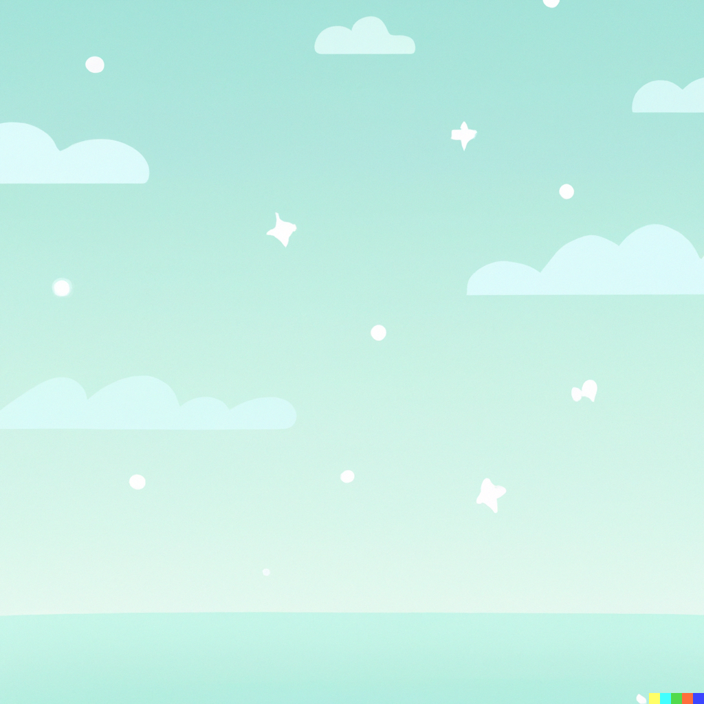

# AI generated childrens story a day

This project allows the generation and management of AI generated children's stories, with the intent to produce a short, unique, coherent story before bed every night.

## Site

The public facing website is accessible at [https://storybook-eosin-five.vercel.app/](https://storybook-eosin-five.vercel.app/).

The site was generated using React NextJS. No server side rendering or APIs are used as part of the site, essentially being a static website. The site is hosted on Vercel.

*Note: Vercel hosting this as a complete app is overkill for this, however learning the hosting workflow for Vercel was a key goal of this project.*

## Site Design

In keeping with AI generation, the site's background and layout was generated by OpenAI's DALL·E 2.

The following prompt was used:

> A background image for a childrens bedtime stories site. The colours should be pastel and feature clouds.

This was then used as a guide to create the site's styling and background images.

## Development

1. Open `storybook.code-workspace` in vs-code if applicable.
2. Follow the individual `README.md` files for the site and server directories.

